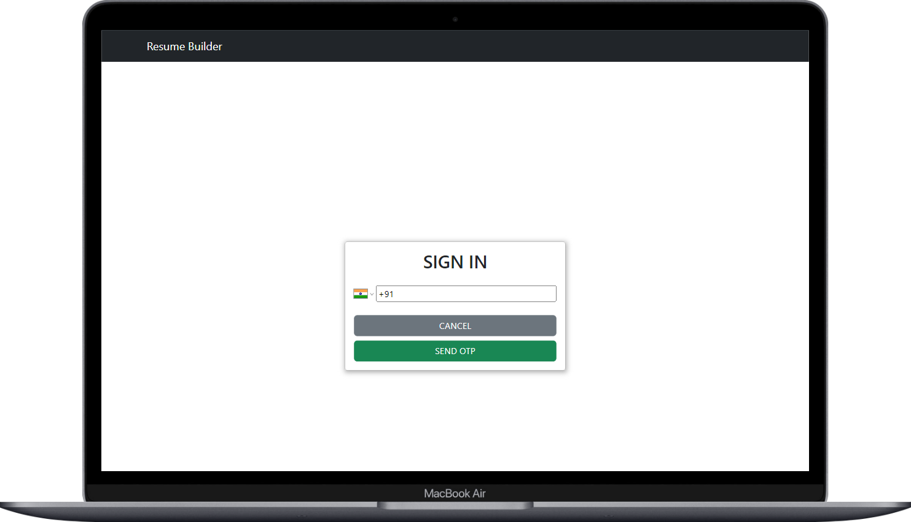
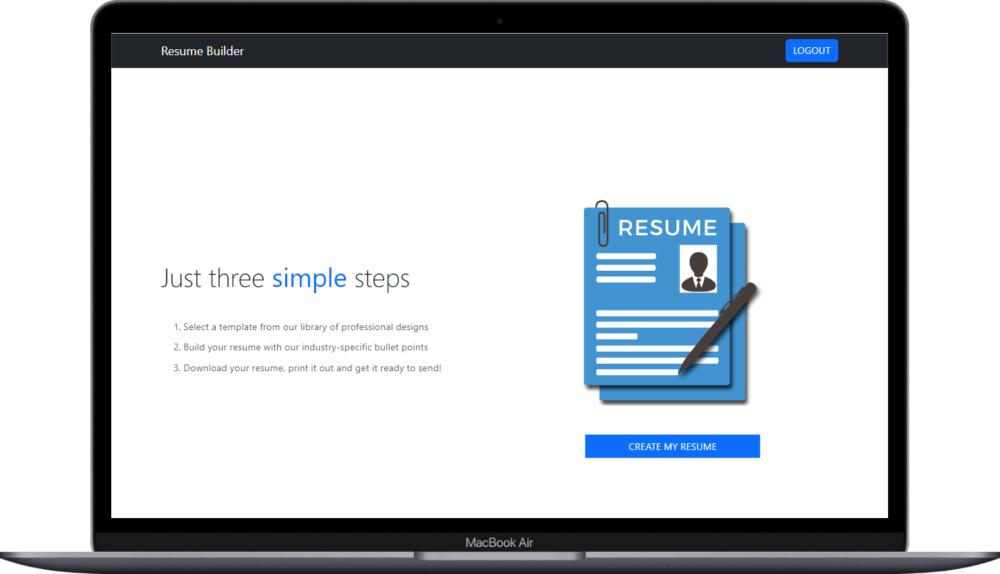
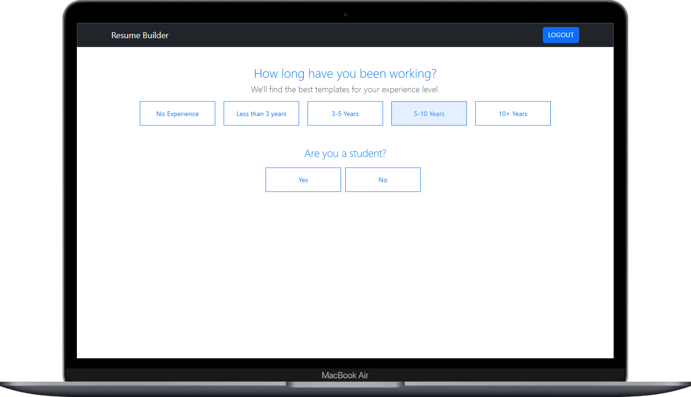
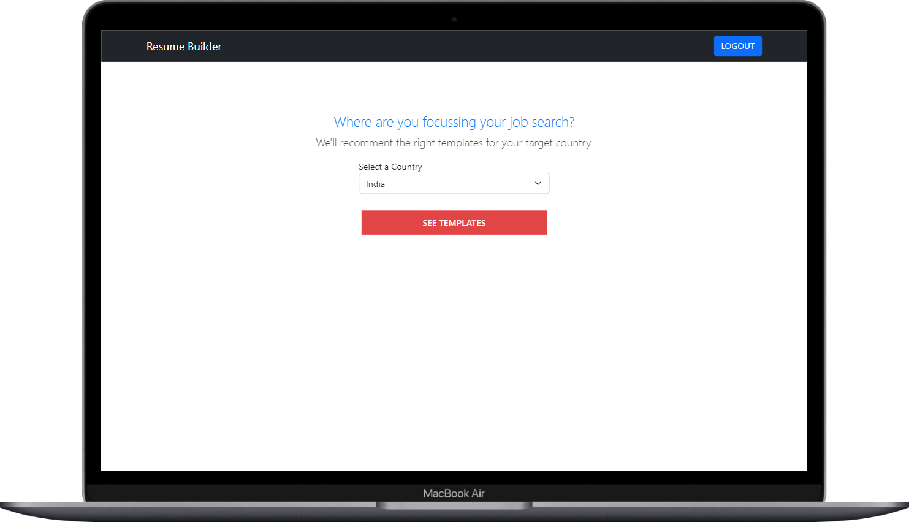
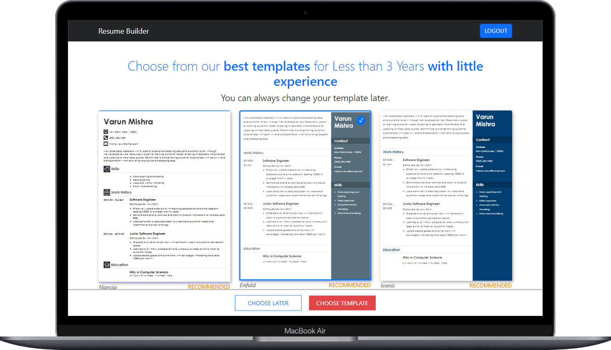
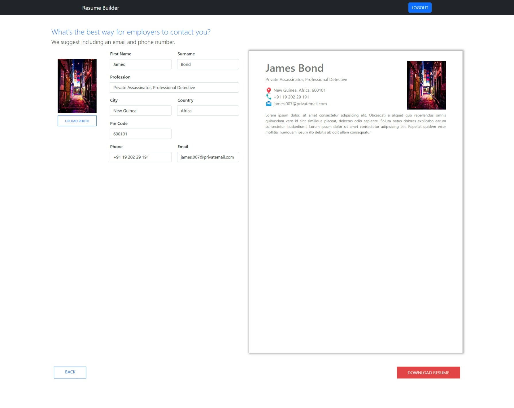

    updated: Tuesday, 6th September 2022

    
    
You need a resume, I need a holiday

# [Resume Builder](https://ressume-builder.vercel.app)

## What's new?

-   Everything

## Table of Contents

-   [Introduction](#introduction)
-   [Acknowledgement](#acknowledgement)
-   [Demo](#demo)
-   [Features](#features)
-   [Tech Stack Used](#tech-stack-used-💻)

## Introduction

-   This was a project which was to be built in a very short time.
-   It helped me learn the basics of Firebase
-   Also it totally challenged my abilities

---

## Acknowledgement

-   Me, My efforts and self Motivations

---

## Demo

1. **Authentication using Phone Number-Firebase**
   

2. **Home**
   

3. **Pages**

|     **Based on Experience**     |      **Select Country**      |
| :-----------------------------: | :--------------------------: |
|  |  |

4. **Drag n Drop**
   

5. **Custom Templatees**
   

6. **Final Page**
   

---

## Features

-   Completely Free of Cost
-   Get templates according to your Experience
-   Authentication using Phone Number
-   No data-loss on page Refresh
-   More Templates comming soon
-   Drag and Drop Feature
-   Live Preview
-   Download as PDF

---

## Tech Stack Used 💻

---

## Support 🙏

This project needs a ⭐️ from you. Don't forget to leave a star ⭐️

---

## License

see [LICENSE]

[license]: https://github.com/warmachine028/resume-builder/blob/main/LICENSE
[resource]: https://github.com/Envoy-VC/awesome-badges
